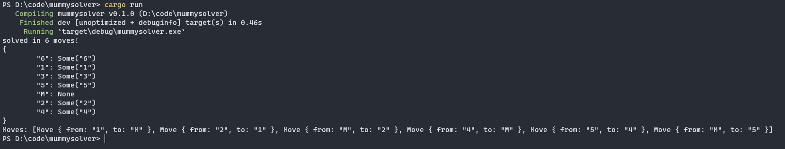

# Mummy Solver

This is a simple Rust implementation of the mummy riddle in the [Horrified board game](https://boardgamegeek.com/boardgame/282524/horrified).

Screenshot:

## TODO
- [ ] Receive state as JSON
- [ ] Compile to WASM and write a JS frontend
